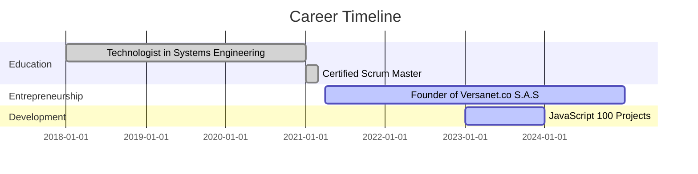

## Hi there 👋, I'm George Patiño!  
**💻 Developer | 🇨🇴 Colombian | 🚀 Tech Enthusiast**  

---

### 🔬 About Me:
I’m a 20-year-old passionate **web and mobile developer**, driven by technology, motorcycles, and travel. I excel in solving problems quickly and effectively while fostering collaboration with my strong social skills. My goal is to create impactful digital solutions and explore innovations.  

---

### 🔠 Skills:
- **Programming Languages:** Java, C++, Dart, JavaScript, TypeScript.
- **Frameworks & Libraries:** React, Node.js, Flutter.
- **Networking & Cloud:** AWS, MikroTik, Optical Fiber, Custom Scripts.
- **Version Control:** Git, GitHub.
- **Soft Skills:** Teamwork, Communication, Fast Problem-Solving.

---

### 🌎 Featured Projects:
- **JavaScript 100 Projects:** [View on GitHub](https://github.com/patgeo117/javascript-100-proyectos)  
  A collection of 100 JavaScript projects showcasing creativity and coding proficiency.

---

### 📈 Certifications and Education:
- **Technologist in Systems Engineering.**
- **Certified Scrum Master.**
- **Entrepreneur:** Founder of [Versanet.co S.A.S](https://versanet.co), a successful internet service company.

---

### 📅 Experience Timeline:


---

### 👤 Resume:
- **Name:** George Patiño.  
- **Age:** 20 years old.  
- **Profession:** Web and Mobile Developer.  
- **Hobbies:** Motorcycles 🏍️, Traveling 🌍.  
- **Key Skills:** Problem-solving, rapid development, teamwork.  
- **Projects:** From tailored web solutions to efficient network systems.  
- **Contact:** [Email me](mailto:gpatino017@gmail.com) or connect on [LinkedIn](https://www.linkedin.com/in/gepdev).  

---

### 👯‍♂️ Open to Collaborate:
- Projects that make **technology accessible** and **fun!** 😎.  
- Open-source contributions that challenge my skills and growth.  

---

### 📊 GitHub Analytics:

  

---

### 🟢 A Touch of Creativity:
#### **Dynamic Progress Bars:**
```html
<div style="display: flex; justify-content: space-between;">
  <div style="width: 30%;">
    <p>React</p>
    <progress value="90" max="100"></progress>
  </div>
  <div style="width: 30%;">
    <p>JavaScript</p>
    <progress value="85" max="100"></progress>
  </div>
  <div style="width: 30%;">
    <p>MikroTik</p>
    <progress value="75" max="100"></progress>
  </div>
</div>
```

---

### 🌈 Visual Enhancements:
Add smooth transitions, vibrant colors, and hover effects using **CSS animations** for sections.
```css
/* Example */
section:hover {
  transform: scale(1.05);
  transition: transform 0.3s ease-in-out;
}
```
